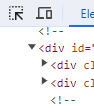
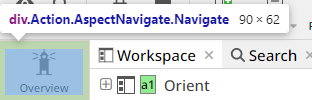
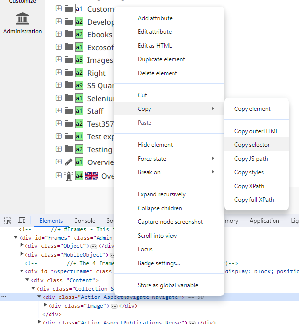

# Skribenta automation test using selenium

## Installation

This project is built using maven, so you can import it to your IDE of choice as a maven project. 

After the project has been imported, you need to install the dependencies. This can be done by running the following command in the root directory of the project:

```bash
mvn install
```

## Project structure

The project is written only in test packages, and the structure is as follows:

- We will have 2 helper classes, one for the general functions (login, open frame, etc) and one for the actions like clicking, typing, selecting, etc.
- Then we will have test classes, each class will handle the tests for a specific function in Skribenta. In this first version, I included the test for the change case function already. You guys can view the code and clone it to make other classes.

## How to extract the selector quickly and correct from Skribenta?

- Open the developer tool in Chrome (F12)
- Go to the inspect button in the top left corner: 
- Click on the element you want to extract the selector from: 
- Go to the `Elements` tab in the developer tool, right click on the element you want to extract the selector from, and select copy -> copy selector: 
- For the example, it will looks like this: `#AspectFrame > div > div > div.Action.AspectNavigate.Navigate`
- If the selector is too long, we can strip it down to the shortest possible selector. For example, the selector above can be shortened to `.Action.AspectNavigate.Navigate`.
- Please note that to ensure the consistency of your test case, you should create a workspace that is specifically for automation testing. This workspace should have the same structure as the production workspace, and you should only use this workspace for automation testing. This will ensure that the test will run correctly for every run.

## How to run the test?
You can run the test by right click on the test class and select `Run` or `Debug`
